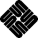
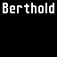
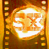
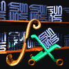
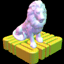
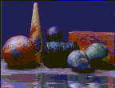
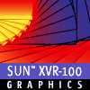
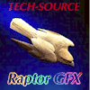

= SUN Framebuffer Logos
Malte Dehling <mdehling@gmail.com>

:imagesdir: https://raw.githubusercontent.com/mdehling/sun-fb-logos/main/

This repository contains SUN framebuffer logos, i.e., the logos you see when
booting a SPARCstation, Ultra, or other SUN machine.  Unless mentioned
otherwise, these are pixel-exact copies of the logos taken straight from the
firmware.

NOTE:  If the colors don't look right, it may be a browser problem.  E.g., on
firefox I had to set `gfx.color_management.mode = 0` in `about:config`.  The
colors in the images are _exactly_ right, so just use a proper image viewer
instead of a browser.

How to Help
-----------
If you have any framebuffers with logos you don't see on this page, you can
help me out by sending me their firmware.  All you need is a serial connection
to your SUN computer.  I wrote a little link:HOWTO.adoc[HOWTO] document
explaining the process.

The Logos
---------

Original
~~~~~~~~
This is the old logo as seen when booting a SUN-3 or early SPARCstation.  If
you have a color framebuffer, e.g., a CG3, the logo is drawn in `sun-blue`
(that's exactly `#6441b4`.)

OEM / Clones
~~~~~~~~~~~~

CG6
~~~

CG14 / SX
~~~~~~~~~
The CG14 / SX has three logos that are shown at random.

TCX / FSV
~~~~~~~~~
image:fsv-logo.png["TCX / FSV Logo"]

TurboZX / Leo
~~~~~~~~~~~~~

RasterFlex-32
~~~~~~~~~~~~~

RasterFlex-HR
~~~~~~~~~~~~~
image:rfx-hr-logo.png["RasterFlex-HR Logo"]

Dome Md5/SBX
~~~~~~~~~~~~

FFB / Creator 3D
~~~~~~~~~~~~~~~~

AFB / Elite 3D
~~~~~~~~~~~~~~

XVR-100
~~~~~~~

PGX32 / Raptor GFXP
~~~~~~~~~~~~~~~~~~~

SPARCbook 3
~~~~~~~~~~~
The smaller logo is the one shown above the banner, the larger is the splash
screen logo shown first when the SPARCbook is powered on.

SPARCbook 3GX
~~~~~~~~~~~~~
The smaller logo is the Tadpole logo shown to the left of the banner, the
larger is the splash screen logo shown first when the SPARCbook is powered on.

Acknowledgements
----------------
A number of people have contributed to this project by sending me PROM images.
Among them are: Mike Spooner and Chris Satterfield.  Thanks a lot!
