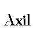
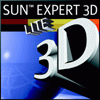
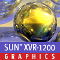
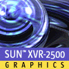
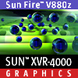
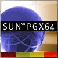

= Sun Framebuffer Logos
Malte Dehling <mdehling@gmail.com>

:imagesdir: https://raw.githubusercontent.com/mdehling/sun-fb-logos/main/

This repository contains Sun framebuffer logos, i.e., the logos you see when
booting a SPARCstation, Ultra, or other Sun machine.  Unless mentioned
otherwise, these are pixel-exact copies of the logos taken straight from the
firmware.

NOTE:  If the colors don't look right, it may be a browser problem.  E.g., on
firefox I had to set `gfx.color_management.mode = 0` in `about:config`.  The
colors in the images are _exactly_ right, so just use a proper image viewer
instead of a browser.

How to Help
-----------
If you have any framebuffers with logos you don't see on this page, you can
help me out by sending me their firmware.  All you need is a serial connection
to your Sun computer.  I wrote a little link:HOWTO.adoc[HOWTO] document
explaining the process.

The Logos
---------

Original
~~~~~~~~
This is the old logo as seen when booting a Sun-3 or early SPARCstation.  If
you have a color framebuffer, e.g., a CG3, the logo is drawn in `sun-blue`
(that's exactly `#6441b4`.)

image:sun-logo.png["B/W Sun Logo"]
image:sun-logo-blue.png["Blue Sun Logo"]

OEM / Clones
~~~~~~~~~~~~

image:oem-logo-axil320.png["Axil 320 Logo"]
image:oem-logo-berthold.png["Berthold Logo"]

CG6
~~~
image:cg6-logo.png["CG6 Logo"]

CG14 / SX
~~~~~~~~~
The CG14 / SX has three logos that are shown at random.

image:cg14-logo0.png["CG14 / SX Logo 0"]
image:cg14-logo1.png["CG14 / SX Logo 1"]
image:cg14-logo2.png["CG14 / SX Logo 2"]

TCX / FSV
~~~~~~~~~
image:fsv-logo.png["TCX / FSV Logo"]

TurboZX / Leo
~~~~~~~~~~~~~
image:leo-logo.png["TurboZX / Leo Logo"]

RasterFlex-32
~~~~~~~~~~~~~
image:rfx-32-logo.png["RasterFlex-32 Logo"]

RasterFlex-HR
~~~~~~~~~~~~~
image:rfx-hr-logo.png["RasterFlex-HR Logo"]

Dome Md5/SBX
~~~~~~~~~~~~
image:dome-md5sbx-logo.png["Dome Md5/SBX Logo"]

FFB / Creator 3D
~~~~~~~~~~~~~~~~
image:ffb-logo.png["FFB / Creator 3D Logo"]

AFB / Elite 3D
~~~~~~~~~~~~~~
image:afb-logo.png["AFB / Elite 3D Logo"]

IFB / Expert 3D
~~~~~~~~~~~~~~~
image:ifb-logo.png["IFB / Expert 3D Logo"]

IFBlite / Expert 3D Lite
~~~~~~~~~~~~~~~~~~~~~~~~

XVR-100
~~~~~~~
image:xvr100-logo.png["XVR-100 Logo"]

XVR-600
~~~~~~~

GFB / XVR-1000
~~~~~~~~~~~~~~

XVR-1200
~~~~~~~~

XVR-2500
~~~~~~~~

Zulu / XVR-4000
~~~~~~~~~~~~~~~

PGX32 / Raptor GFXP
~~~~~~~~~~~~~~~~~~~
image:tsi-gfxp-logo.png["PGX32 / Raptor GFXP Logo"]

PGX64 / ATI RageXL
~~~~~~~~~~~~~~~~~~

Raptor GFX 550e
~~~~~~~~~~~~~~~

Raptor 1100T
~~~~~~~~~~~~
image:tsi-rap1kt-logo.png["Raptor 1100T Logo"]

Raptor 4000
~~~~~~~~~~~

Raptor MED 12 SL
~~~~~~~~~~~~~~~~
image:tsi-meds-logo.png["Raptor MED 12 SL Logo"]

JavaStation-NC / Krups
~~~~~~~~~~~~~~~~~~~~~~
These are the various segments of the boot screen as contained in the OBP: The
name banner is displayed in the middle-right area of the screen.

The loading animation is shown to the left of the name banner.  In case of a
network timeout the question mark appears, and an error is indicated by the
exclamation point.

These are the individual frames of the Loading animation.

image:krups-oslogo-1.png["JavaStation-NC Loading Animation Frame 1"]

image:krups-oslogo-4.png["JavaStation-NC Loading Animation Frame 4"]

SPARCbook 3
~~~~~~~~~~~
The smaller logo is the one shown above the banner, the larger is the splash
screen logo shown first when the SPARCbook is powered on.

image:sparcbook-3-logo.png["SPARCbook 3 Logo"]

image:sparcbook-3-splash.png["SPARCbook 3 Splash Screen"]

SPARCbook 3GX
~~~~~~~~~~~~~
The smaller logo is the Tadpole logo shown to the left of the banner, the
larger is the splash screen logo shown first when the SPARCbook is powered on.

image:sparcbook-3gx-logo.png["SPARCbook 3GX Logo"]

image:sparcbook-3gx-splash.png["SPARCbook 3GX Splash Screen"]

Acknowledgements
----------------
A number of people have contributed to this project by sending me PROM images.
Among them are: Neill Griffin, Mark Mehalik, Darko Mesaroš, Alan Perry, Gábor
Samu, Chris Satterfield, Mike Spooner, Valery Ushakov, and Irinikus from
irixnet.org.
Thanks a lot, everyone!
